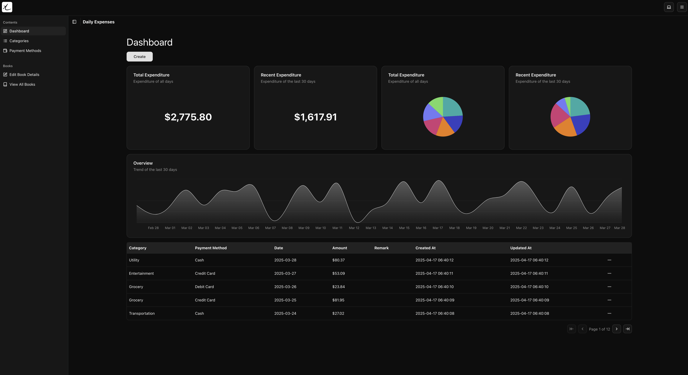

  

  

# Xpense

A simple and elegant web application for managing your expenses. Built with Next.js,
TypeScript, and Supabase.

## Demo

You can try out the demo at [xpense.jljl1337.com](https://xpense.jljl1337.com)
with email `demo@xpense.com` and password `demoPassword1234`.

## Usage

1. Set up the backend [xpense-backend](https://github.com/jljl1337/xpense-backend)
   with Supabase.
2. Download `compose.yml` and `env.example` and rename the latter to `.env`.
3. Fill in the `.env` file with your Supabase credentials.
4. Run `docker compose up -d` to start the application.
5. Access the application at `http://localhost:3000`.
